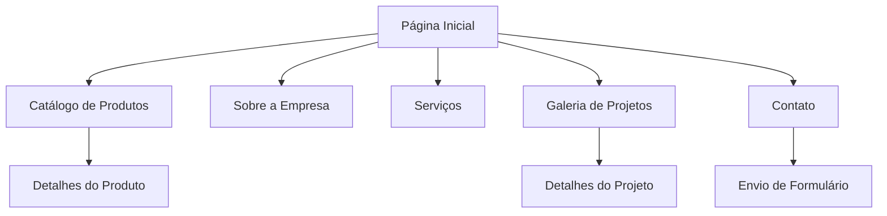

# Documento de Requisitos de Produto - Madeireira Tronco Forte

## 1. Visão Geral do Produto

Aplicação web institucional interativa para a madeireira "Tronco Forte" que transmite solidez, tradição e qualidade premium no mercado madeireiro. O site deve evocar a força natural da madeira e expertise artesanal, combinando elementos orgânicos com geometria industrial precisa para estabelecer confiança e credibilidade junto aos clientes.

O produto visa apresentar os serviços da madeireira, catálogo de produtos e informações corporativas através de experiências interativas e envolventes, posicionando a empresa como referência em qualidade e tradição no setor. Inclui recursos avançados de engajamento, funcionalidades administrativas e tecnologias modernas para uma experiência de usuário superior.

## 2. Funcionalidades Principais

### 2.1 Papéis de Usuário

| Papel          | Método de Acesso        | Permissões Principais                                                            |
| -------------- | ----------------------- | -------------------------------------------------------------------------------- |
| Visitante      | Acesso direto ao site   | Navegar por todas as páginas, visualizar catálogo, enviar formulários de contato |
| Usuário Padrão | Acesso sem autenticação | Acesso completo a todas as funcionalidades públicas do site                      |

### 2.2 Módulo de Funcionalidades

Nossos requisitos consistem nas seguintes páginas principais:

1. **Página Inicial**: hero section com texto animado, calculadora interativa, rastreabilidade, timeline sustentável, posts em destaque, depoimentos, WhatsApp flutuante.
2. **Sobre a Empresa**: história com vídeo de fundo, missão, valores, equipe especializada.
3. **Catálogo de Produtos**: categorias organizadas, detalhes técnicos, galeria de imagens, animações scroll-based.
4. **Contato**: formulário interativo com opções avançadas, localização, informações de atendimento.
5. **FAQ**: perguntas e respostas organizadas com interface expansível.
6. **Blog**: posts com categorias, sistema de busca, paginação.
7. **Dashboard Admin**: gerenciamento de posts e categorias com autenticação segura.

### 2.3 Detalhes das Páginas

| Nome da Página | Nome do Módulo         | Descrição da Funcionalidade                                                                                       |
| -------------- | ---------------------- | ----------------------------------------------------------------------------------------------------------------- |
| Página Inicial | Hero Section           | Logotipo com tronco estilizado, texto animado alternando palavras-chave, cores mogno/verde/dourado, CTA principal |
| Página Inicial | Calculadora            | Ferramenta interativa para estimativa de custos de projetos com materiais e dimensões                             |
| Página Inicial | Rastreabilidade        | Seção sobre origem da madeira, certificações, processo de qualidade                                               |
| Página Inicial | Timeline Sustentável   | Jornada da empresa em práticas sustentáveis com animações scroll-based                                            |
| Página Inicial | Posts Destaque         | Últimas publicações do blog com preview e links para artigos completos                                            |
| Página Inicial | Depoimentos            | Carousel de avaliações de clientes com fotos e projetos realizados                                                |
| Página Inicial | CTA Contato            | Seção "Pronto para Começar?" com formulário rápido e botão WhatsApp flutuante                                     |
| Sobre Empresa  | Vídeo Background       | Apresentação institucional com vídeo de fundo mostrando processos produtivos                                      |
| Sobre Empresa  | História Interativa    | Timeline com marcos importantes, animações e conteúdo expansível                                                  |
| Sobre Empresa  | Equipe                 | Perfis dos profissionais com especialidades e experiência                                                         |
| Catálogo       | Categorias Animadas    | Madeiras nobres, compensados, MDF com hover effects e transições                                                  |
| Catálogo       | Filtros Avançados      | Sistema de busca por tipo, dimensão, aplicação, preço                                                             |
| Catálogo       | Galeria Interativa     | Zoom, visualização 360°, comparação de produtos                                                                   |
| Contato        | Formulário Inteligente | Campos dinâmicos baseados no tipo de projeto, validação em tempo real                                             |
| Contato        | Mapa Interativo        | Localização com direções, horários, informações de contato                                                        |
| FAQ            | Accordion Interface    | Perguntas organizadas por categoria com busca e expansão suave                                                    |
| Blog           | Sistema Busca          | Campo de pesquisa com filtros por categoria, data, tags                                                           |
| Blog           | Grid Responsivo        | Layout adaptativo com preview de posts e paginação                                                                |
| Blog           | Categorias             | Sistema de tags e categorias com contadores de posts                                                              |
| Dashboard      | Autenticação           | Login seguro com email/senha, sessões protegidas                                                                  |
| Dashboard      | Gerenciar Posts        | CRUD completo para artigos com editor rich text                                                                   |
| Dashboard      | Gerenciar Categorias   | Criação, edição e organização de categorias do blog                                                               |

## 3. Processo Principal

O fluxo principal do usuário inicia na página inicial onde é apresentado à identidade visual robusta da Tronco Forte. A partir do hero section com o logotipo centralizado, o usuário pode navegar pelo menu principal para explorar o catálogo de produtos, conhecer a história da empresa, visualizar serviços oferecidos, conferir projetos realizados e entrar em contato.

O processo de navegação é intuitivo e direto, permitindo que o usuário encontre rapidamente as informações desejadas sobre produtos madeireiros e serviços, sempre mantendo a percepção de qualidade premium e tradição.

## 4. Design da Interface do Usuário

### 4.1 Estilo de Design

**Paleta de Cores:**

* Primária: Marrom mogno profundo (#8B4513) - riqueza natural da madeira nobre

* Secundária: Verde floresta (#2D5016) - sustentabilidade e origem natural

* Acentos: Dourado envelhecido (#B8860B) - qualidade premium e tradição

* Neutros: Cinza carvão (#36454F) e off-white cremoso (#FAF7F0)

**Tipografia:**

* Sans-serif robusta e geométrica para "TRONCO" com peso bold e tracking expandido

* "FORTE" em caixa alta, levemente condensada, centralizada

* Hierarquia visual clara com o tronco como âncora

**Elementos Visuais:**

* Logotipo com tronco estilizado e anéis de crescimento concêntricos

* Texturas sutis de grãos de madeira como padrões de fundo

* Iconografia Lucide Icons para consistência

* Botões com estilo sólido, bordas bem definidas e micro-interações

**Layout:**

* Design baseado em cards com espaçamento generoso

* Navegação superior fixa com hierarquia clara

* Grid responsivo para galeria de produtos e projetos

* Elementos com respiração adequada e animações scroll-triggered

### 4.2 Tecnologias e Padrões

* **Frontend**: Tailwind CSS para estilização responsiva e consistente

* **Interatividade**: Alpine.js para gerenciamento de estado e eventos

* **Ícones**: Lucide Icons para interface consistente e moderna

* **Build**: Bun como gerenciador de pacotes JavaScript

* **Backend**: Flight PHP framework minimalista

* **Abordagem**: Mobile-first design com progressive enhancement

* **Acessibilidade**: HTML5 semântico com ARIA (WCAG 2.1 AA)

* **Performance**: Lazy-loading para imagens, componentização para reutilização

* **Nomenclatura**: Convenções específicas (ex: "isMobileMenuOpen")

* **Créditos**: "Desenvolvido por Essência Marketing e Gestão"

### 4.2 Visão Geral do Design das Páginas

| Nome da Página | Nome do Módulo    | Elementos da UI                                                                                                     |
| -------------- | ----------------- | ------------------------------------------------------------------------------------------------------------------- |
| Página Inicial | Seção Hero        | Logotipo centralizado com tronco estilizado, tipografia robusta em marrom mogno, fundo com textura sutil de madeira |
| Página Inicial | Navegação         | Menu horizontal com itens em verde floresta, hover com dourado envelhecido, layout limpo e geométrico               |
| Página Inicial | Destaques         | Cards de produtos com bordas em cinza carvão, imagens com overlay sutil, textos em hierarquia clara                 |
| Catálogo       | Grid de Produtos  | Layout em grid responsivo, cards com sombra sutil, filtros laterais com checkboxes customizados                     |
| Sobre          | Seção História    | Timeline vertical com marcos importantes, ícones de ferramentas tradicionais, paleta terrosa                        |
| Serviços       | Lista de Serviços | Cards horizontais com ícones geometrizados, descrições em tipografia clara, call-to-actions em dourado              |
| Galeria        | Grid de Projetos  | Galeria em mosaico com hover effects, lightbox para visualização ampliada, categorização visual                     |
| Contato        | Formulário        | Campos com bordas sólidas, labels em verde floresta, botão de envio em dourado com hover effect                     |

### 4.3 Responsividade e Interatividade

O produto é mobile-first com design responsivo completo e alta interatividade:

* Otimização para touch interaction em dispositivos móveis

* Navegação adaptativa com menu hamburger animado

* Elementos de interface ajustados para diferentes tamanhos de tela

* Animações baseadas em scroll para engajamento

* Micro-interações para feedback visual imediato

* Lazy-loading inteligente para performance otimizada

* Alto contraste para acessibilidade visual

* Componentes reutilizáveis com Alpine.js

* Transições suaves entre estados e páginas

